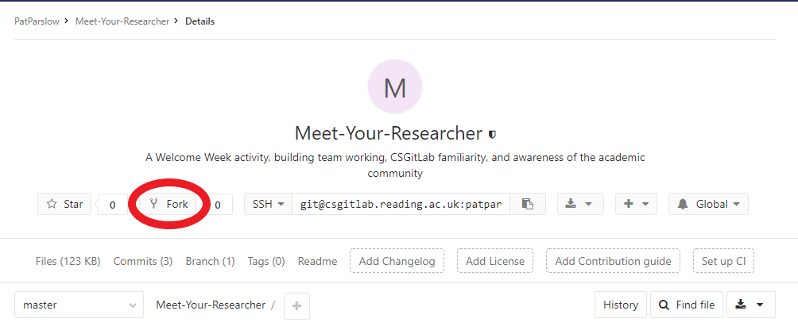
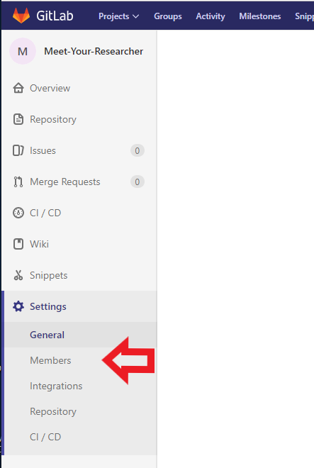
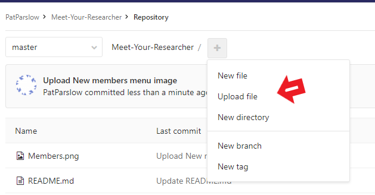
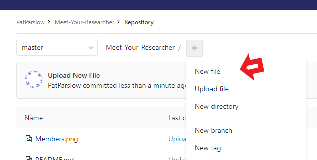

Some hints to help navigate
=====

*Forking* creates a copy of the project that you own and can edit.  You can also add your team members to the project

You can use the search to find your team members.  Try adding patparslow to your team as well.

Adding new files
=====

You can create files on the local PC and upload them, or edit online.  If you are creating a Markdown document, you must end it's filename with ".md" for it to be rendered properly.

Use your time in the lab to experiment - and ask questions!